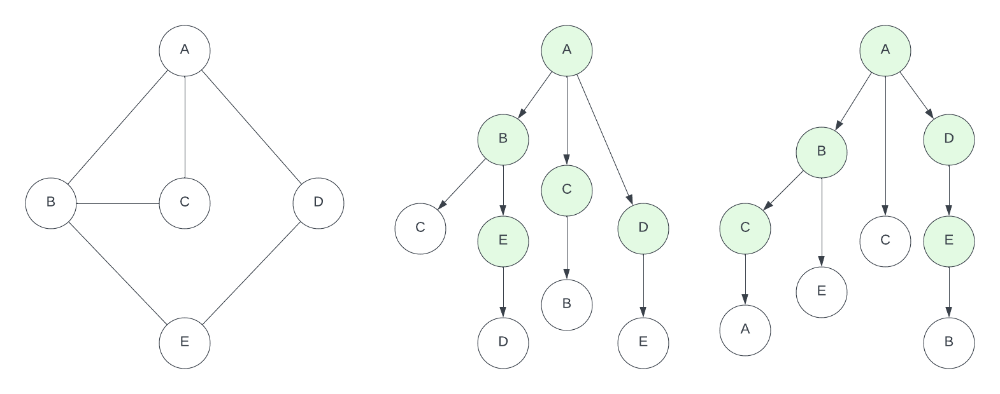

# Transaction flooding


## Pseudo-code

The pseudo-code below represents a simple reliable broadcast protocol.
The `brodcast(tx)` primitive is the input of the protocol; it is invoked by
clients to initiate the broadcast of a transaction `tx`.
The `deliver(tx)` primitive is the output of the protocol; it delivers
received transactions, which are added to the mempool.

```go
var peers // peers to which the node is connected, dynamic set
var seen  // set of transactions already seen, initially empty

upon brodcast(tx):
    if tx not in seen
        add tx to seen
        deliver(tx) // Add to the mempool
        for all q in peers
            send <tx> to q

upon receive <tx> from s:
    if tx not in seen
        add tx to seen
        deliver(tx) // Add to the mempool
        for all q in peers \ {s}
            send <tx> to q
```

The protocol operates in a peer-to-peer (p2p) network, in which each node is
directly connected to a set of `peers`.
The `peers` set is managed by the underlying p2p communication layer, which can
add new peers, as connections are established, or remove existing peers, when
existing connections are dropped.

Transactions are disseminated by flooding, as the node sends every transaction
it receives to all its `peers`.
A transaction can be received via the `broadcast(tx)` primitive or via the
network unicast `receive` primitive.
In the case of transactions received from the network, the node does not send
the transaction back to the node `s` from which the transaction was received.
The messages `<tx>` exchanged by nodes encode a transaction.

The `seen` set is used in the pseudo-code to determine whether a transaction is
received for the first time.
A transaction can be received by a node multiple times, but it should only be
delivered and sent to peers once.
The adoption of the `seen` set thus provides a simple mechanism to cease the
propagation of transactions.

## Propagation graph

The operation of the transaction flooding protocol when disseminating a
transaction `tx` can be represented by a propagation graph,
a directed graph with sets of vertices and links defined as follows:

- Vertices are tuples `(p, s, t)` and represent the execution at node `p` of
  the step `s` of the protocol at a reference time `t`.
  Steps correspond to the pseudo-code `broadcast(tx)` or `receive <tx>` upon clauses.
- Links represent the sending of a message between to nodes and correspond to
  pseudo-code `send <tx>` primitives.
  A link connects a `broadcast(tx)` or `receive <tx>` step at a node `p` to a
  `receive <tx>` step at node `q` when the protocol defines that `p` at that
   step should send a `<tx>` message to its peer `q`.

The inclusion of the reference time `t` to label a vertex of the propagation
graph has two goals.
The first is to render vertices unique, since the same node `p` can execute
the same step `s` (e.g., `receive <tx>`) multiple times.
The second reason is to determine the _first time_ at which a step of the
protocol is executed by a node, which is relevant because a node only take
actions regarding a transaction the first time it is received.

The picture below provides two examples of propagation graphs for a network
with five nodes.
The undirected graph on the left represents the connections between the nodes,
thus the content of the `peers` set for each of the nodes.
For instance, node `A` has `{B, C, D}` as its peers,
while node `D` has `{A, E}` as peers.



The two directed graphs are propagation graphs representing two distinct
executions of the protocol.
Notice that the vertices `(p, s, t)` are labeled only with the node identifier
`p` $\in$ `{A, B, C, D, E}`.
The protocol step `s` of a vertex is not depicted but it can be derived:
vertices without inbound links, such as the root `A`, represent the
`broadcast(tx)` step,
while vertices with inbound links represent the `receive <tx>` step.
The reference time `t`, also not depicted on the graphs, is assumed to increase
from top to bottom.
